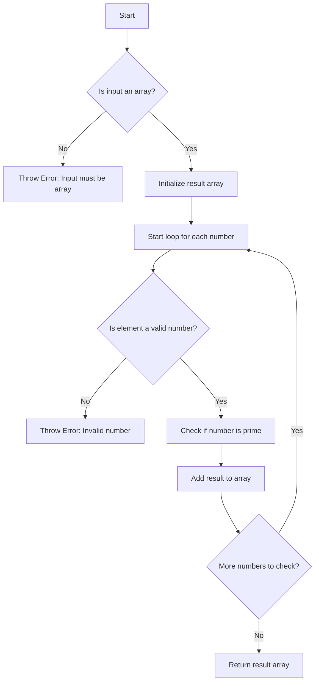

# Array Prime Check Flowchart

This diagram represents the logic of the `checkArrayForPrimes` function.



## Explanation

1. First validates that the input is an array
2. Initializes an empty result array
3. For each number in the input array:
   - Validates that the element is a valid number
   - Uses `checkIfPrime` to determine if the number is prime
   - Adds the result (true/false) to the result array
4. Returns the final array of boolean values

## Example
```javascript
const numbers = [2, 3, 4, 5, 6, 7, 8, 9, 10];
const results = checkArrayForPrimes(numbers);
// results = [true, true, false, true, false, true, false, false, false]
``` 