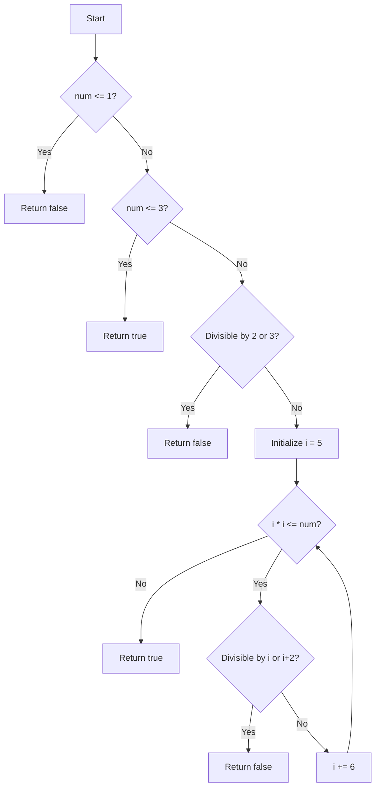

# Prime Number Check Flowchart

This diagram represents the logic of the `checkIfPrime` function.

## Explanation

1. First checks if the number is less than or equal to 1 (not prime)
2. Then checks if the number is 2 or 3 (prime)
3. Checks divisibility by 2 or 3
4. Main loop checks divisibility by numbers of the form 6k ± 1
5. Returns true if no divisors are found, false otherwise 